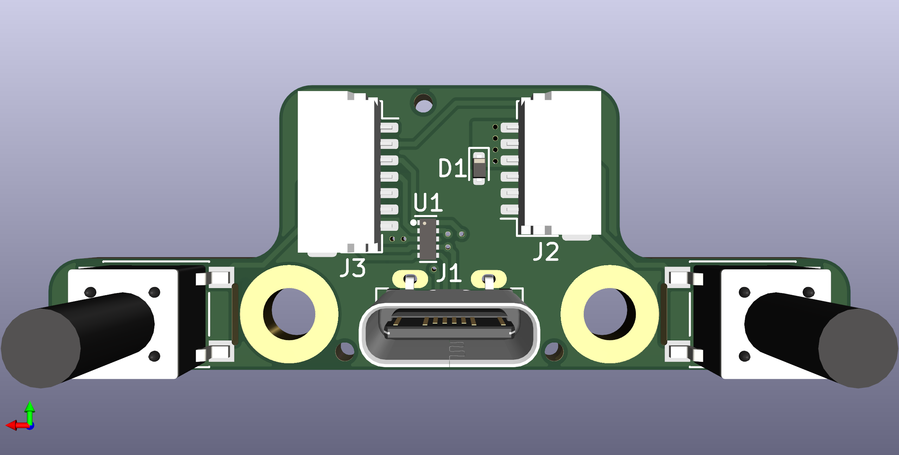

# Galia
USB-C breakout board.

## Disclaimer
This board is licensed under CC BY 4.0.
## Key Features
* Full ESD protection for data lines and VBUS.
* Two buttons on board that can be snapped off.
* Two M3 mounting holes, one of which is connected to ground for earthing the chassis.
* 6-pin JST SH connector capable of handling up to 3A power.

## Changelog
* 26/07/2023: Fixed position of button and mounting holes. Added JLC tooling holes.
* 25/07/2023: Changed 8 pin JST SH connector to 6 pin. Changed orientation of SH connectors for easier routing of wires. Added Ariamelon logo. Added PCB cutouts to allow for buttons to be snapped off.
* 21/07/2023: Changed 20 pin FFC to 7 pin and 8 pin JST SH connector. Fixed orientation.
* 18/07/2023: Changed JST connector back to 20 pin FFC. Centered connector.
* 17/07/2023: Changed 20 pin FFC connector to 14 pin JST SH connector. Repositioned components.
* 16/07/2023: Changed PTS645 LCSC part number.
* 14/07/2023: Initial public upload of V1.0.